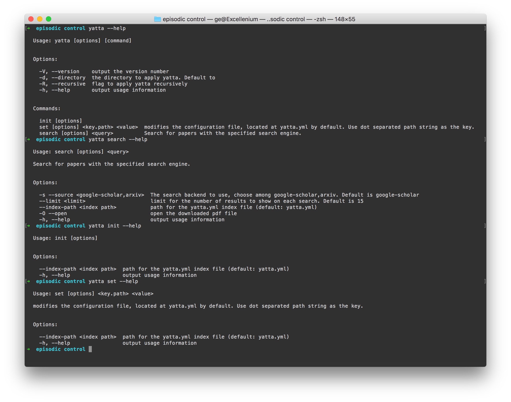

# yatta 

yatta is a cli tool that manages your paper PDFs. It is `npm` for papers.     [:rocket::beer:Share Me on HackerNews!:fire::star:](https://news.ycombinator.com/submitlink?u=https://github.com/episodeyang/yatta&t=Yatta%20|%20NPM-for-science-papers)
- **Have you ever wanted to save paper PDFs in your work folder?**
- **Have you ever had duplicates of the same PDF in different project folders?**
- **Have you ever wanted to share a list of readings with someone, except that your own PDFs all have personal notes and highlights?**

`yatta` is the tool that solves all of these problems for you. It is a package manager for links and papers. It saves a index of bibliography data in a `yatta.yml` file in your work folder, so that if you want to share those papers, you can just send someone the index, and have them do `yatta download`. 

We solve some of the annoying problems, so that you don't have to. Plus `yatta` is open source, so you can help shape the direction it goes!

[](https://asciinema.org/a/158365)

## Usage

First run `npm install -g yatta`. If you don't have node on your computer, first install it from [here](https://nodejs.org/en/download/). Alternatively you can use `brew install node` on a mac.
Then, go to a folder where you want to save your readings:
```bash
mkdir my_awesome_deep_learning_project
cd my_awesome_deep_learning_project
yatta init
```
Now yatta should create a `yatta.yml` file for you. This is going to be the index file for `yatta`.

To search and download papers, do
```bash
yatta search --source arxiv "Generative Adversarial Imitation Learning"
```
and it gives the following result:
[placeholder image]

### We support the FULL arxiv search query syntax!

for example for the following query, you get:
```bash
yatta search au:bellemare ti:compress and controll
```





